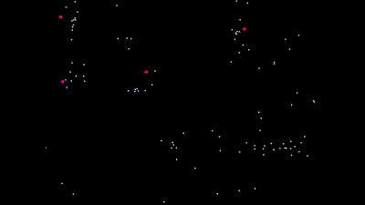

# flocking
simulation of flocking boids in numpy and pygame

A simple implementation of Craig Reynolds flocking boids in python, with the addition of predatory boids and evasion behaviour. 
Evasion is implemented by altering the steering rule. 

https://en.wikipedia.org/wiki/Boids

dependencies: numpy, pygame.

The flocking.py file runs a full simulation using the Boid and predatory Pboid objects from the boid.py file.

In flocking_opt.py/boid_opt.py the way distances are calculated is optimized and vectorized, making this implementation much more efficient. In this version predators are not implemented.

